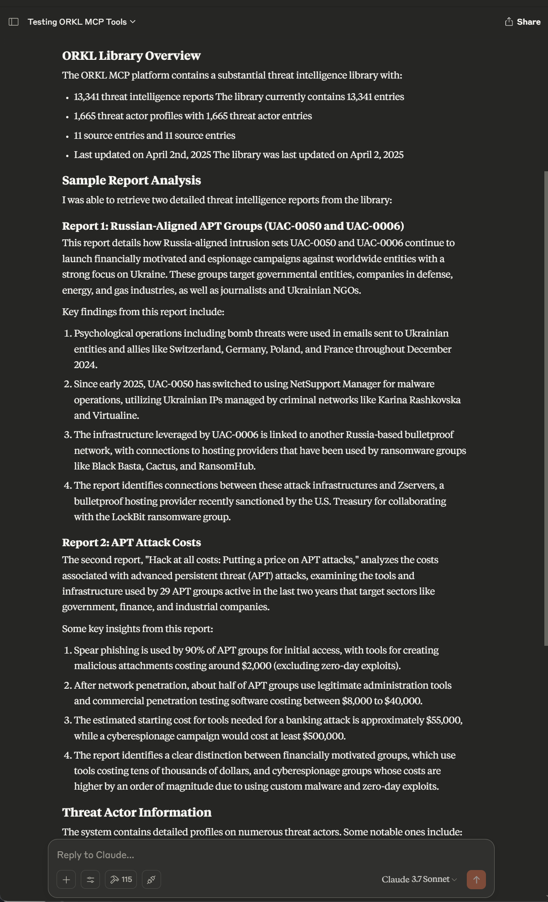

# ORKL MCP Server

A MCP (Model Control Protocol) server for accessing the [ORKL Threat Intelligence Library](https://orkl.eu/).

## Table of Contents

- [Features](#features)
- [Getting Started](#getting-started)
    - [Prerequisites](#prerequisites)
    - [Installation](#installation)
    - [Configuration](#configuration)
- [MCP Tools](#mcp-tools)
- [MCP Resources](#mcp-resources)
- [Example Prompts](#example-prompts)
- [License](#license)

## Features

- Access to ORKL Threat Intelligence Library data via the [ORKL API](https://orkl.eu/api/v1/doc/index.html)
- Efficient caching to minimize API calls
- Rate limiting to respect ORKL API restrictions
- Standardized MCP Tools and Resources for LLM interaction
- Built-in support for Claude Desktop integration

Screenshot



## Getting Started

### Prerequisites

- Python 3.10 or later
- [uv](https://github.com/astral-sh/uv) package manager (recommended)

#### Installation

1. Clone the repository:
   ```bash
   git clone https://github.com/heiths/orkl_mcp_server.git
   cd orkl_mcp_server
   ```

2. Install dependencies using uv (recommended):
   ```bash
   uv venv
   uv pip install -r requirements.txt
   ```

3. Configure the server (see [Configuration](#configuration) section below)

#### Register with Claude Desktop

Add the following config to your `claude_desktop_config.json`:

```json
{
  "ORKL Threat Intelligence": {
    "command": "uv",
    "args": [
      "--directory",
      "/path/to/orkl_mcp_server",  <-- Replace with the path to the cloned repository
      "run",
      "python",
      "run_server.py"
    ],
    "env": {
      "ORKL_API_BASE_URL": "https://orkl.eu/api/v1",
      "ORKL_REQUEST_TIMEOUT": "30",
      "ORKL_CACHE_TTL": "300",
      "ORKL_USE_CACHE": "1",
      "ORKL_RATE_LIMIT_REQUESTS": "90",
      "ORKL_RATE_LIMIT_PERIOD": "30"
    }
  }
}
```

## MCP Tools

The server provides the following MCP Tools:

- `fetch_latest_threat_reports`: Get recent threat intelligence reports
- `fetch_threat_report_details`: Get details about a specific report
- `fetch_threat_report_by_hash`: Retrieve a report by SHA1 hash
- `search_threat_reports`: Search for reports matching criteria
- `get_library_info`: Get information about the ORKL library
- `get_library_version`: Get version information
- `fetch_threat_actors`: Get a list of all threat actors
- `fetch_threat_actor_details`: Get detailed information about a threat actor
- `fetch_sources`: Get a list of available sources
- `fetch_source_details`: Get detailed information about a source
- `clear_cache`: Clear the local cache for fresh data

## MCP Resources

The server provides these MCP Resources:

- `threat_reports://{report_id}`: Direct access to specific reports
- `threat_actors://{actor_id}`: Direct access to threat actor information
- `sources://{source_id}`: Direct access to source information

## Example Prompts

### Malware Investigation

>I found a suspicious file with SHA1 hash '5f2b7f47b2c9da342583c3a7e3887b4babad0fa9'. Can you check if this hash is
>associated with any known threats in the ORKL database and provide details about its capabilities and attribution?

### Threat Landscape Overview

>Can you provide an overview of the current threat landscape for financial institutions? Use the ORKL API to search for
>relevant threat reports from the past month and identify emerging trends or notable threat actors.

## Configuration

Configuration can be provided through:

1. Environment variables
2. A JSON configuration file (`config.json` in the current directory)

### Environment Variables

| Variable                   | Description                   | Default                  |
|----------------------------|-------------------------------|--------------------------|
| `ORKL_API_BASE_URL`        | API base URL                  | `https://orkl.eu/api/v1` |
| `ORKL_REQUEST_TIMEOUT`     | Request timeout in seconds    | `30`                     |
| `ORKL_CACHE_TTL`           | Cache time-to-live in seconds | `300`                    |
| `ORKL_USE_CACHE`           | Enable caching (1/0)          | `1`                      |
| `ORKL_RATE_LIMIT_REQUESTS` | Maximum requests per period   | `90`                     |
| `ORKL_RATE_LIMIT_PERIOD`   | Rate limit period in seconds  | `30`                     |
| `ORKL_CONFIG_FILE`         | Path to configuration file    | `config.json`            |

## License

This project is licensed under the MIT License - see the LICENSE file for details.
